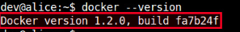

## The Definitive Guide to Running Shiny Apps in Microsoft Azure
## Add a link to this project in sandbox once complete

# Purpose
This is a guide on how to build and deploy a dockerized shiny app on Azure Container Registry with Web Service and CI/CD pipeline.

# Steps Overview

# Project directory organization
To dockerize an app we use a Dockerfile, a file which specifies how Docker is supposed to build your application. 
It contains the steps Docker is supposed to follow to package your app. Once that is done, you can send
 this packaged app to anyone and they can run it on their system without any problems or need to download dependencies or libraries. Everything is self-contained.

# Project Structure
Let's start with the project structure. You will have to keep Dockerfile at the root of your project. A basic project will look as follows -

- app.py
- Dockerfile
- requirements.txt
- some_app_folder/
-   some_file
-   some_file

# Build Shiny App
We begin by making our shiny app. You can do this in R by going to File> New File > Shiny Web App. 

Once you have your app, you're going to want to dockerize it so everyone in your department can make use of your useful app without needing to go to a dreaded transfer drive or ask them to send you files.

# Installing Docker
Before we get into how to write a Dockerfile, you'll need to have Docker installed. You can find this in the Docker.com page. For help with installing Docker, refer to this link: https://docs.docker.com/docker-for-windows/ . To test and see if you successfully installed Docker, in Command Prompt or PowerShell, type docker --version

# Dockerfile
Go deep on this, on what each command does and why.

A Dockerfile is a text document that contains all the instructions needed to create an image. An image is an inert, immutable, file that's essentially a snapshot of a container. Images are created with the build command, and they'll produce a container when started with run. Images get stored in a registry.

Docker can build images automatically by reading the instructions from a Dockerfile. Each instruction will create a new image layer to the image. Instructions specify what to do when building the image.

The Dockerfile starts with a base image that decides which image your app should be built upon. 

you can pack your application with all of the binaries and runtime libraries, back-end tools, and even specific services your application needs for running — and make it readily available for instant delivery and automatic deployment.

## Base Images
Talk about FROM scratch option

## Installing libs
R and linux stuff

## Moving files into image

## Ports
There is a runtime docker build argument `-p 80:80' that needs to go here to map web port to container

# Azure Resource Groups
Overview and creation

# Azure Container Registry Service
setting this up

# Build Pipeline
config, build and push tasks, commit triggers on specific branches

# Web App Service
Docker container app option, you can test it live now before creating the release pipeline

# Release Pipeline
more config, remember to "unlink all", enable CD, set the trigger, specify the branch
